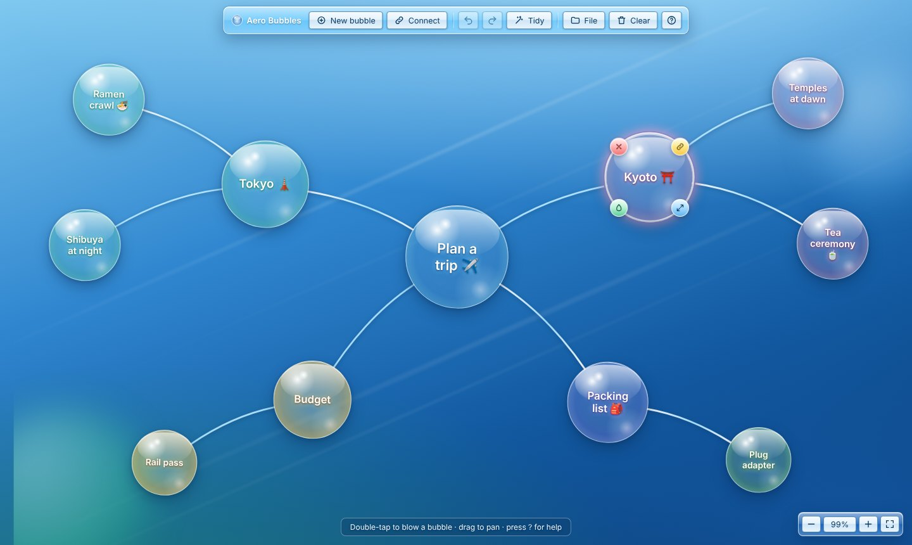

# Aero Bubbles

A glossy, Windows 7 Aero–inspired mind map where ideas float as soap bubbles.
Blow a bubble, type a thought, and wire it to others.



## Features

- **Infinite canvas**: drag to pan, pinch or Ctrl + scroll to zoom, and fit the whole map to the screen in one click.
- **Bubbles that feel alive**: each one drifts on its own rhythm, and the wires follow it. A bubble holds still when you grab it. Reduced-motion settings are respected.
- **Fast mind-mapping**: <kbd>Tab</kbd> sprouts a connected child. Drag the 🔗 chip onto a bubble to connect, or onto empty space to grow a new branch.
- **Multi-select**: Shift + drag draws a selection box, and Shift + click toggles bubbles. Move, recolour, duplicate or pop many at once.
- **Six glass colours**, resizable bubbles, and wires you can select and cut.
- **Tidy up**: a force-directed layout untangles crowded maps with a smooth animation.
- **Undo / redo** for every change, including whole drags and bursts of nudges, each as a single step.
- **Autosave** to the browser, plus **JSON save/open** and **PNG / SVG export** that matches the on-screen look.
- **Keyboard-first and accessible**: full shortcut set, arrow-key navigation between bubbles, ARIA roles, screen-reader announcements, and no keyboard traps.
- **Works on touch**: double-tap to create, pinch to zoom, chips that stay finger-sized at any zoom.
- **One-file build**: `npm run build:standalone` emits a single self-contained `index.html` that you can open straight from disk.

Press <kbd>?</kbd> in the app for every gesture and shortcut.

## Getting started

Requires Node.js 22.12+ (the CI uses the version in [`.nvmrc`](.nvmrc)).

```sh
npm install
npm run dev          # http://localhost:5173
```

| Script                     | What it does                                                 |
| -------------------------- | ------------------------------------------------------------ |
| `npm run dev`              | Start the Vite dev server with hot reload                    |
| `npm run build`            | Type-check and build to `dist/` (static, relative paths)     |
| `npm run build:standalone` | Build a single self-contained `dist-standalone/index.html`   |
| `npm run preview`          | Serve the production build locally                           |
| `npm test`                 | Unit tests (Vitest + happy-dom)                              |
| `npm run test:e2e`         | End-to-end tests in Chromium, desktop and touch (Playwright) |
| `npm run lint`             | ESLint with type-aware rules                                 |
| `npm run typecheck`        | `tsc -b` in strict mode                                      |
| `npm run format`           | Prettier                                                     |
| `npm run check`            | Format check, lint, typecheck and unit tests, all in one     |

The first time you run the e2e tests, install a browser with `npx playwright install chromium`.
If a Chromium is already installed, point `PLAYWRIGHT_CHROMIUM_EXECUTABLE` at it instead.

## Project structure

```
src/
├── main.ts               Entry point
├── app/                  Composition root
│   ├── app.ts            Builds and wires every piece
│   └── commands.ts       Command registry: every button, menu item and shortcut
├── core/                 Application state
│   ├── editor.ts         Editor: state, selection, undo history, change events
│   └── actions.ts        Editing operations (create, connect, delete…)
├── model/                Pure data, no DOM
│   ├── map.ts            Immutable mind-map operations
│   ├── history.ts        Snapshot undo/redo with coalescing
│   ├── serialize.ts      Versioned JSON format with validation and repair
│   ├── palette.ts        Bubble colours (single source of truth)
│   └── welcome.ts        First-run tutorial map
├── geometry/             Pure maths
│   ├── viewport.ts       Pan/zoom transforms
│   ├── link-path.ts      Arched wires trimmed to bubble rims
│   ├── layout.ts         Child placement, tidy-up relaxation, spatial navigation
│   └── text-fit.ts       Label font sizing
├── view/                 DOM rendering
│   ├── scene.ts          Keyed renderer and animation loop
│   ├── bubble-view.ts    One bubble's DOM and drift
│   ├── link-view.ts      One wire's SVG
│   └── …                 Float maths, pop effect, icons, palette CSS
├── interaction/          Input
│   ├── pointer.ts        Gesture state machine: pan, drag, marquee, resize, connect, pinch
│   ├── keyboard.ts       Key bindings and dispatcher
│   └── inline-editor.ts  In-place label editing
├── ui/                   Chrome: status/toasts, menu, colour picker, help dialog
├── persistence/          Autosave and file open/save
├── export/               SVG renderer and PNG rasteriser
└── styles/               CSS split by concern
tests/e2e/                Playwright specs
build/inline-bundle.ts    Vite plugin behind the single-file build
```

## Architecture

```
 pointer / keyboard / toolbar
            │
            ▼
   commands & actions ──► Editor ──(subscribe)──► Scene ─► DOM
                          │  state                ├► InlineEditor
                          │  history              ├► Autosave ─► localStorage
                          ▼                       └► toolbar, status, zoom label
                     model (pure, immutable)
```

- **One source of truth.** The `Editor` holds the document, the viewport, the selection and the interaction modes. Nothing else changes state, and views subscribe to it.
- **Immutable documents.** Every edit returns a new `MindMap` and shares the parts that didn't change. That makes undo a matter of keeping references, and lets the renderer find changes by identity: a drag touches only the moved bubbles and their wires.
- **Gestures are single undo steps.** A drag _previews_ states without recording history, then _commits from_ its starting snapshot when the pointer is released.
- **Commands are data.** Toolbar buttons, menu items, key bindings, tooltips and the help dialog all come from the same registry, so they can't drift apart.
- **Pure core, thin shell.** `model/` and `geometry/` never touch the DOM and are unit-tested directly. DOM behaviour is covered by happy-dom tests and real-browser Playwright tests.

### File format

Maps are saved as versioned JSON. Opened files are treated as untrusted: unknown colours, out-of-range sizes, duplicate ids and dangling or duplicate links are repaired, and files from newer versions are rejected with a clear message.

```json
{
  "format": "aero-bubbles",
  "version": 1,
  "nodes": [
    { "id": "n_k3x9q2m1", "x": 0, "y": -10, "d": 150, "text": "Big idea ✨", "color": "sky" }
  ],
  "links": [{ "id": "l_8f2kd0aa", "a": "n_k3x9q2m1", "b": "n_p0w7c4zz" }],
  "viewport": { "x": 640, "y": 400, "zoom": 1 }
}
```

## Deployment

[`.github/workflows/deploy.yml`](.github/workflows/deploy.yml) publishes `dist/` to GitHub Pages on every push to `main`.
Enable it once under **Settings → Pages → Build and deployment → Source: GitHub Actions**.
The build uses relative paths, so it also works from any sub-path or static host.

[`.github/workflows/ci.yml`](.github/workflows/ci.yml) runs formatting, lint, type-checking, unit tests, both builds and the Playwright suite on every push and pull request.
It also uploads the single-file build as a downloadable artifact.

## Browser support

Current Chrome, Edge, Firefox and Safari (desktop and mobile).
The app uses Pointer Events, CSS individual transforms, `color-mix()`, `<dialog>` and `backdrop-filter`.
